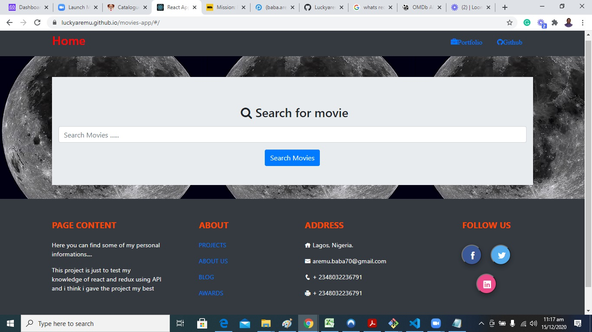

# movie app
A basic React and Redux movies app. It displays base on movie name searched for by the user. 

The webapp should have at least 2 types of pages:

# Catalogue of Statistics
- one page with a list of items that could be filtered by some parameters; 
- one page for the item details; 

- Basic movies app
- Users can:
    - See all movies you want
    - Get the details of the movie

# Screenshot


# Live Demo
[Live Demo Link](https://luckyaremu.github.io/movies-app/#/) 

[Presentation Link](https://www.loom.com/share/1d498c04d501474493d67a78796f91e8) 

# Built With

- HTML 
- CSS
- SCSS
- BOOTSTRAP
- JAVASCRIPT
- NPM
- REACT
- NODE
- NETLIFY
- ESLINT
- STYLELINT
- GITHUB ACTIONS

### Usage
- Clone the project 
```
git clone https://github.com/Luckyaremu/movies-app
```
- Run `npm install` to install the local dependencies
- Run `npm start` to launch local development server
- The project should launch in your default browser
- Visit `http://www.omdbapi.com/apikey.aspx` and register for an api key
- create an .env file in the root folder and add 
`REACT_APP_MOVIEDB_API_KEY=YOUR_REACT_API_GOES_HERE`
- Make sure you replace `YOUR_REACT_API_GOES_HERE` with you own key


## Authors

👤 **Lucky Aremu**


- Github: [@githubhandle](https://github.com/Luckyaremu)
- Twitter: [@twitterhandle](@luckyaremu)
- Linkedin: [linkedin](https://www.linkedin.com/in/lucky-aremu-24807a145/)

# 🤝 Contributing
Contributions, issues and feature requests are welcome!
Feel free to check the issues page

# Show your support
Give a ⭐️ if you like this project!

This project is [MIT](lic.url) l